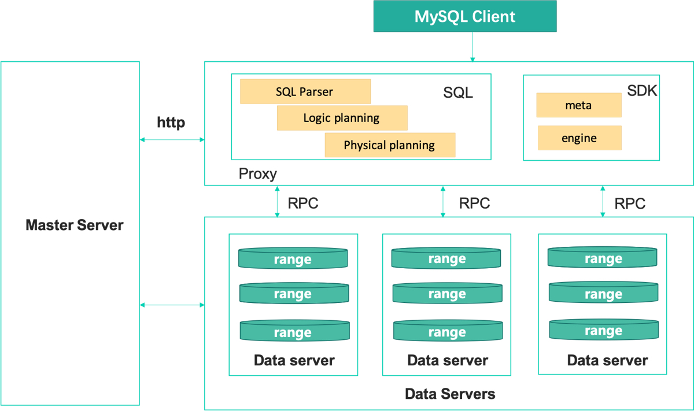

Introduct
=============

ChubaoDB is a cloud-native memory-centric distributed database, R & D based on google spanner paper, support Redis protocol and MySQL protocol; 

can be understood as JIMDB/redis +  Vitess/MySQL

Key Features
=============

High Performance
------------------------

* Memory centric

* Excellent read performance + good write performance

Low Cost
------------------------

* Dual storage engines

* Intelligent scheduling

Availability, Consistency, Scalability, and Reliability
----------------------------------------------------------------

* Raft-base replication

* Automatic range partitioning & balancing

* Automatic failover

Cloud Native
------------------------

* Orchestrated by Kubernetes

Easy migration
------------------------

* Migration tools

* Support Redis/MySQL, almost no need to change code

Managable
------------------------

* management system

* alarm system

* rich monitoring report

Architecture
===============

Master Server

* Metadata management (routing, schema, etc.)

* Cluster dispatching (failover, balanced scheduling, etc.).

Proxy

* Handling user SQL client access

* Analyze SQL, logic optimization, physical optimization finally to data node read and write data

Data Server

* data storage node

* Slice by range, raft-3

