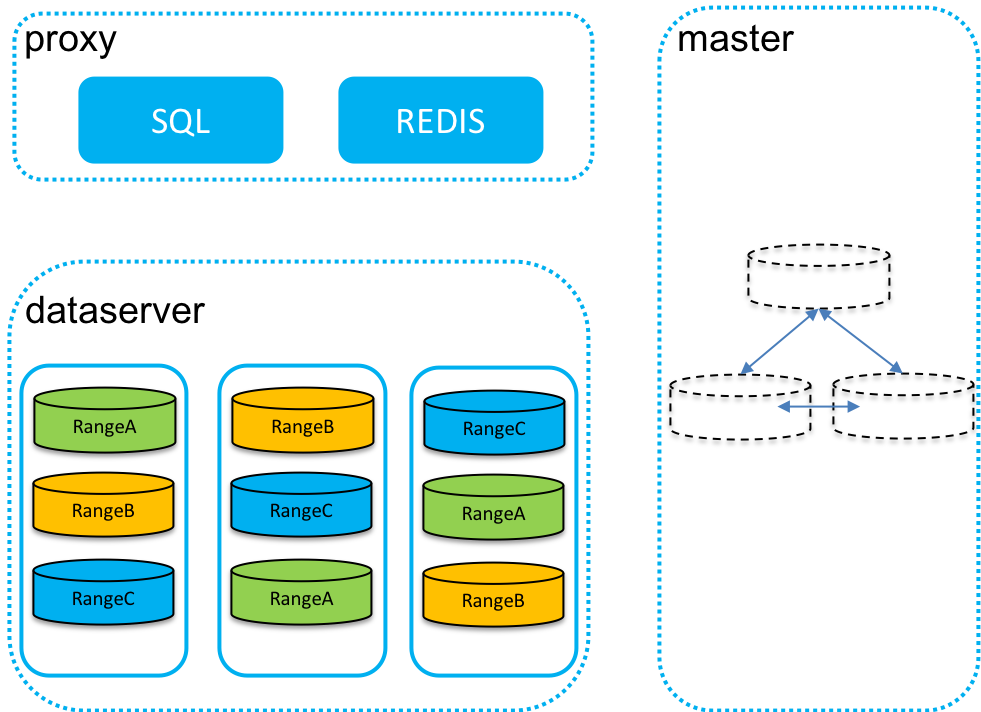

Introduction
=============

ChubaoDB is a cloud-native memory-centric distributed database, support Redis protocol and MySQL protocol; 

High Level Architecture
------------------------

Key Features
------------------------

High Performance
^^^^^^^^^^^^^^^^^^^^^

* Memory centric

* Excellent read performance + good write performance

Low Cost
^^^^^^^^^^^^^^^^^^^^^

* Dual storage engines, memory or disk

* Intelligent scheduling, Separating hot-cold data into heterogeneous storage 

Availability, Consistency, Scalability, and Reliability
^^^^^^^^^^^^^^^^^^^^^^^^^^^^^^^^^^^^^^^^^^^^^^^^^^^^^^^^^^^^^^^

* Raft-base replication

* Automatic range partitioning & balancing

* Automatic failover

Cloud Native
^^^^^^^^^^^^^^^^^^^^^

* Orchestrated by Kubernetes

Online-schema-change
^^^^^^^^^^^^^^^^^^^^^

